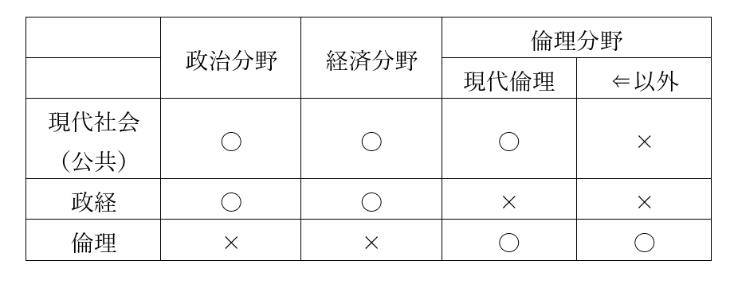
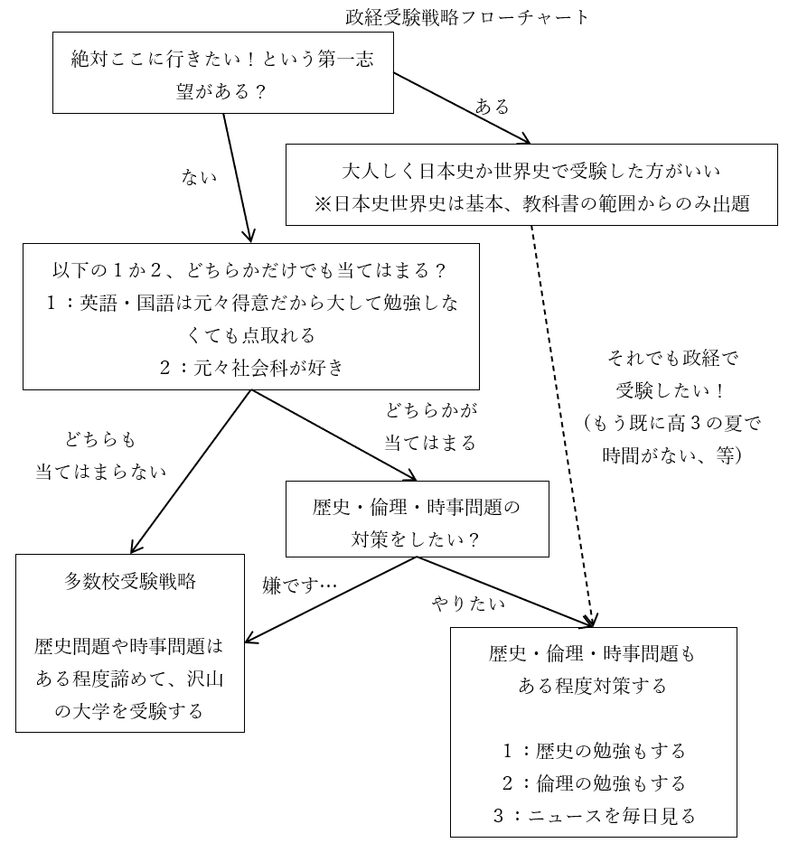

# 高校社会科／公民ガイダンス資料  
  
  
## ●本授業が効果的な人  
・定期試験対策をしたい高校生  
・大学受験対策をしたい人  
  
・大学の準備をしたい人  
⇒経済学部へ行きたい人や、社会学、経営学、法学、政治学、国際政治学、哲学といった学問を大学でやるための準備をしたい人  
  
・大人になってからの学び直しをしたい人  
・テレビ、新聞、ネットニュース等媒体問わず、ニュースを見る素養を身に付けたい人  
※結局社会科ってのは究極、詐欺に遭わない為の教科です。理科をちゃんとやっておけば水素水とかマイナスイオンに騙されないのと同じ  
  
※一応高校受験対策をしたい中学生も使えますが、コスパは悪いです  
  
  
## ●高校公民の構造  
・一般的に、高校の公民と言えば公共（改名前は現代社会）、政経（正式名は政治経済）、倫理  
・大学受験でもこの三科目を、組み合わせたりしなかったりしながら使う  
・そして実はこの三科目、それぞれ範囲が被っている  
  
  
  
  
・前掲表の対応表は、大学受験でも同じである  
例１：試験科目が「政経」なら政治分野と経済分野から出題される。倫理分野からは出題されない  
例２：試験科目が「公共」なら、政治・経済分野全部が出題範囲だが、政経ほど難しい問題は出ない  
例３：試験科目が「公共」なら、倫理分野は一部の範囲しか出題されない  
※公共で出てくる倫理分野は、具体的には「西洋思想史」「青年期」「現代倫理」（生命倫理とか環境問題とかそういうの）の三単元となる  
  
・尚、令和四年度（西暦2022年度）の高校一年生から、現代社会が廃止されて公共になる  
・公共の内容は基本、現代社会と同じ。なので、現代社会の参考書を使っても大きな問題はない  
⇒公共から現代社会へと授業の名前が変わっても、授業で扱う内容は殆ど変わっていない。強いて言えば、西洋思想史が大々的に扱われるようになったところが違う。そこだけ注意しておくとよい  
  
  
## ●授業の受け方  
・予習は不要  
・復習は（定期試験対策や大学受験対策の人は）必要  
  
・復習用資料はwebに上げています  
・何なら授業動画一覧もあります  
  
|資料|動画|  
|:----:|:----:|  
|[英語／中学復習講座](https://teacheramesaka.github.io/reviewenglishjh/)|[動画一覧](https://teacheramesaka.github.io/reviewenglishjh/LIST.html)|  
|高校社会科／公民ガイダンス ↑今見てるページはコレ|[公民ガイダンス動画](https://www.youtube.com/watch?v=HRJkEYP2FC8)|  
|[高校社会科／公民／政治分野](https://teacheramesaka.github.io/highschoolpolitics/)|[動画一覧](https://teacheramesaka.github.io/highschoolpolitics/LIST.html)|  
|[高校社会科／公民／経済分野](https://teacheramesaka.github.io/highschooleconomics/)|[動画一覧](https://teacheramesaka.github.io/highschooleconomics/LIST.html)|  
|[高校社会科／公民／倫理分野](https://teacheramesaka.github.io/highschoolethics/)||  
  
※授業の動画を見る時、手元に復習用資料を用意しておく必要はありません。ただあった方がいいのは事実なので、スマホで動画を見ながらタブレットで復習用資料を表示しておくとか、そういう事が可能なのであればそうしてください  
  
### 〇大学受験する人について  
・大学受験対策で私の授業を受ける人は、「教科書となる何か」を用意しましょう  
⇒学校の教科書でも、市販の参考書でも構いません。本屋でぱらぱらめくってみて、解説が気に入ったものを選びましょう。勿論私の作った復習用資料を教科書にしても可  
  
・私の授業を受けたら、自分の教科書でも復習しましょう  
・その際重要単語をマークしたり、ノートを作ったりするのも大事です  
・現役生の場合、高校三年生の夏休み終了前後には、受験に必要な全範囲を終わらせましょう  
※以下の、現役高三受験生の場合の一般受験予定表を参照。尚、全科目共通で、これぐらいの感覚で受験勉強をしましょう  
  
|時期|予定|  
|:----:|:----:|  
|九月前後|受験に必要な全範囲の学習を一通り終わらせる 夏休み終了時点で終わっているように、学習予定を組みたい|  
|十月前後|章別の問題集で総復習 ※「第一章　経済の仕組み」「第二章　社会福祉」みたいになってる問題集|  
|十一月前後|共通テスト・センター試験の過去問に取り組む ※少なくとも十年分は取り組むとよい|  
|十二月前後|大学入試本番の過去問に取り組む|  
|一月|大学入試共通テスト|  
|二月、三月|大学入試本番|  
  
※過去問にせよ問題集にせよ、「間違った問題」及び「正解だったが自信を持って解けた訳ではない」問題は、教科書の該当範囲に戻って復習しましょう  
  
  
## ●大学受験で公民科を使う場合の問題  
### ○概要  
・大学受験（の一般選抜、いわゆる一般受験）では、公民科目を使う人も多い  
・大学受験で公民系科目を使う場合、大抵は以下の３パターンである  
  
１：国公立理系志望の人が、大学入試共通テストで使う  
２：国公立文系志望の人が、大学入試共通テストで使う  
※たま～～～に二次試験で使える場合があるものの、非常に少ない  
３：私大文系志望の人が、大学入試共通テスト及び大学入試本番で使う  
※ほぼ、政経を使う事になる。政経以外の公民系科目で受験できる私大は非常に少ない  
  
・で。共通テストしか受けないのであれば、特に問題はない  
・例えば政経を使って受験するとして、政経の範囲（政治分野と経済分野全部）を勉強しておけば問題ない  
・なのでここから先を見る必要もない。問題は、大学入試本番でも公民を使う場合である  
・つまり３の人、私大文系志望者は、この先を見てよくよく検討する必要がある  
  
・と言うのは、公民科を使った私大受験の本番には、大きな問題があるのだ  
・例えばあなたが私大文系学部志望で、英語、現代文、政経の三科目で二次試験を受けたとする  
・で、政経の問題用紙を見てみたら…  
  
「これ世界史の問題じゃねぇか！」「政経じゃここまでやらねぇよ！！」  
「ニュース毎日見てるような奴じゃねぇとこんな問題解けねぇよ！！」  
  
・みたいな事態が多発するのである  
  
・何でこうなるかと言うと、公民は本来、社会科が得意な人向け科目なのだ  
・つまり、こう↓いう人向けの科目なのである  
１：歴史が好きで、世界史も日本史も大体の流れは分かってます！  
２：政治ニュースとか経済ニュースとか好きで、毎日見てます！  
  
・何なら、教科書読んでるだけでも「ああこれ世界史を学習してる前提だな」みたいな記述が普通にある  
・政経にしろ倫理にしろ公共にしろ、実はそういう科目なのである  
※私の授業は、社会科苦手な人でも大丈夫なように作っています。なので安心して授業受けてください  
  
・そういう訳で、特に私大の場合「政経で受験できる」大学と「政経で合格できる」大学が変わってくる  
・「一般入試の科目として政経を選べるが、当然のように世界史or倫理の問題が出る」大学もある  
・「時事問題という名目で最近のニュースの内容を大量に出題する」大学もある  
・正直、政経の範囲からしか問題出さない大学はあまり多くない  
・しかも「例年政経の範囲からのみ出題してた」のに「今年急に世界史問題出すようになった」があり得る  
  
・公民系科目（と言うか政経）を使って私大を受験する場合、運要素がかなり強くなってしまうのである  
  
  
### ○私大文系を公民系科目で受験する人の考え方  
・↓ここまでのまとめ  
  
|||  
|:----:|:----:|  
|国公立を受験する人にとっての公民系科目|普通に勉強すればいい。言ってみれば、「教科書の範囲だけやっておけば何とかなる」|  
|私大文系を受験する人にとっての公民系科目|運要素が強い。「教科書の範囲以外も普通に出る」かもしれないし、「教科書の範囲だけからしか出ない」かもしれない|  
  
・ここまで見てきたように、「私大文系を公民系科目で受験する人」の前には、大きな問題がある  
・ただ、私大文系を公民系科目で受験する事に、利点が全くない訳でもない  
・こういった人にとっての現実をまとめると、以下のようになる  
  
|||  
|:----:|----|  
|基本|九割がた政経を使う事になる ⇒なので以下の話も、基本政経で受験する前提 ⇒政治分野と経済分野を全部やるのが基本となる|  
|利点|・学校で使う教科書の厚さで言えば、世界史や日本史の半分しかない ⇒少なくとも、「政経の範囲から出題された問題」を解く能力は、一年ガチるだけで充分身につく ※世界史もしくは日本史で受験するのは、二年計画じゃないと結構厳しい |  
|欠点|・大学と年度によっては、政経の範囲以外からも問題が出る。具体的には以下 １：世界史や日本史の問題 ２：倫理分野（の西洋思想史）の問題 ３：時事問題 |  
  
・これらをどう考えていくか？  
・基本的には以下のフローチャートを使って考えるとよい  
  
  
  
・このフローチャートに従って、どうするかを決めるとよい  
  
・尚、多数校受験戦略を採らない場合でも、沢山の大学を受験するのはよいことである  
⇒結局のところ、大学受験はギャンブルである。ガチャやくじ引きと同じである。沢山の試験を受けて、「あ、今回の試験は俺の得意なところから出てる、これなら八十点は取れる！」となれば合格する。受験勉強とは、その「得意なところ」を増やす作業に過ぎない。なので、一般受験をする（一般選抜で受験する）なら、最低でも十校は受けた方がいい  
  
  
### ○歴史・倫理・時事問題もある程度対策する場合  
・歴史の問題や倫理の問題にも対応したい人は、当然それらの科目を学ぶ必要がある  
・政経の場合、これらは以下のところから出題される  
  
|||  
|:----:|----|  
|歴史|近現代、特に第二次世界大戦以降の世界史からの出題が多い 同時期の日本史からもたまに出る|  
|倫理|ほぼ西洋思想史からの出題が多い|  
  
・そういう訳で、近現代世界史と倫理の西洋思想史、次いで近現代日本史…という形になる  
・ところで、世界史にせよ倫理にせよ、学校の教科書をいきなり読み始めるのは全く推奨できない  
・まずは入門書を読んでからでないと、恐らく、何も頭に入らない  
  
・倫理については、飲茶著『史上最強の哲学入門』をお勧めしておく  
⇒学習参考書ではないが、西洋思想史の入門に適する。後は学校の倫理の教科書を使ってもよし、本屋の学習参考書コーナーで「教科書とする何か」を見つけてもよし  
  
・世界史については、山﨑圭一著『一度読んだら絶対に忘れない世界史の教科書』をお勧めしておく  
⇒学習参考書ではないが、古代から現代までの世界史を一通り、かつざっくりやってくれるので入門に適する。ただこれで受験勉強は無理なので、後は学校の世界史の教科書を使ってもよし、本屋の学習参考書コーナーで「教科書とする何か」を見つけてもよし  
  
・一方時事問題は、基本、毎日ニュース見てるような人じゃないと解けないものが出題される  
※実は「毎日ニュース見てるような人じゃないと解けない」を通り越して、「ニュース解説ができるぐらいじゃないと解けない」問題もあるが、そういうのに対応しようとするのは正直無理があるので気にしない方がいいだろう  
  
・故に時事問題にも対応したい人は、ニュースを常日頃から見ておく必要がある  
※このニュースは、別にテレビや新聞である必要はない。別にインターネットでも構わない。実際、著者の家にはテレビはなく、新聞も取っておらず、基本的にツイッターでニュースを蒐集している。そういうのでも構わない  
  
・尚、これらの勉強にかまけて肝心の政経の範囲の勉強が中途半端になった、というのはあり得る  
・英語、国語、政経の勉強が優先で、歴史・倫理・時事問題の対策の優先度は一段落とすべきである  
・現実的なやり方としては、例えば以下のようなものが挙げられる（あくまで例）  
１：政経の範囲の勉強をまず全力でやる（世界史や倫理に対応する勉強は後回し）  
２：１の結果、時間が余りそうなら世界史や倫理もやる  
３：時事問題に関しては、さしあたっては、普段からニュースを見るように心がける（例えば普段眺めているツイッターのフォローに、ニュース系のアカウントを追加しまくっておく）形で対応する  
